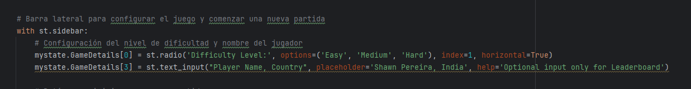
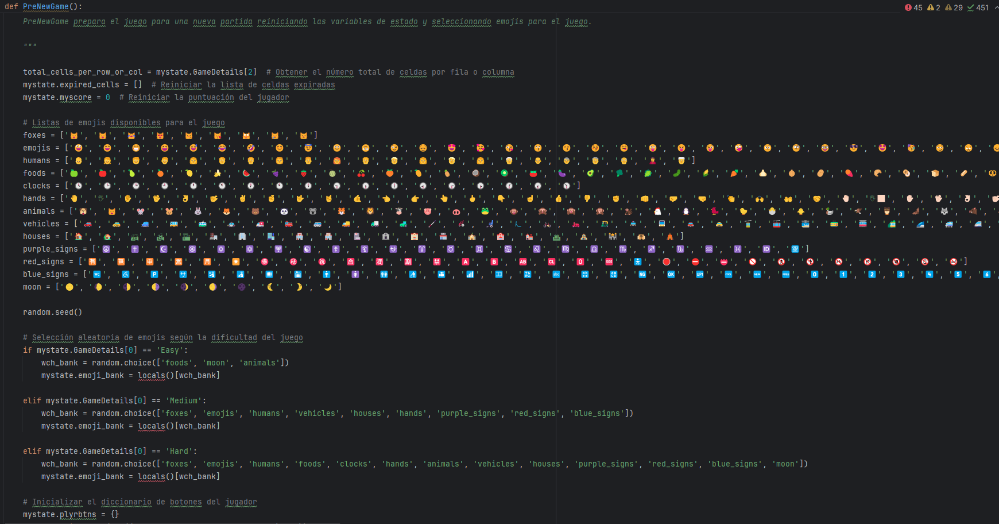
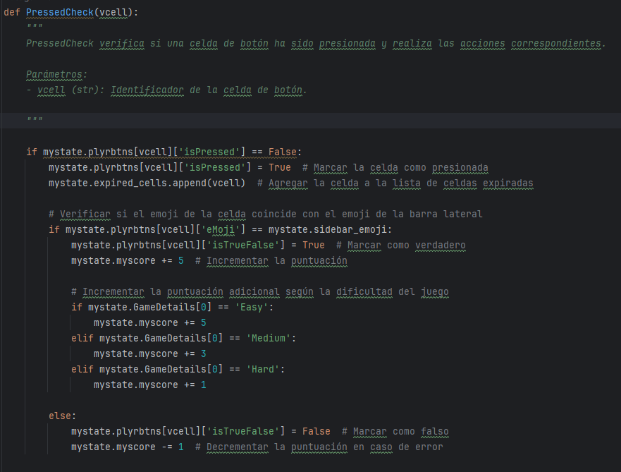
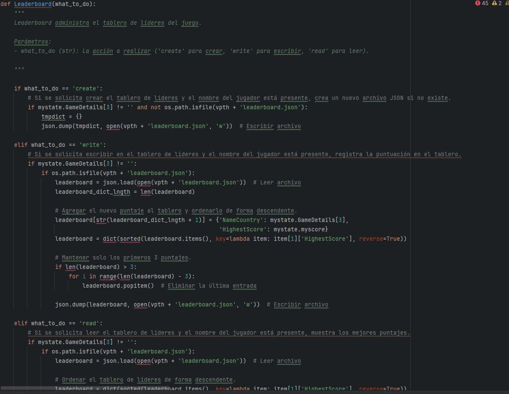
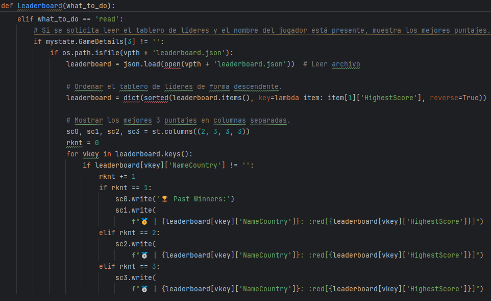
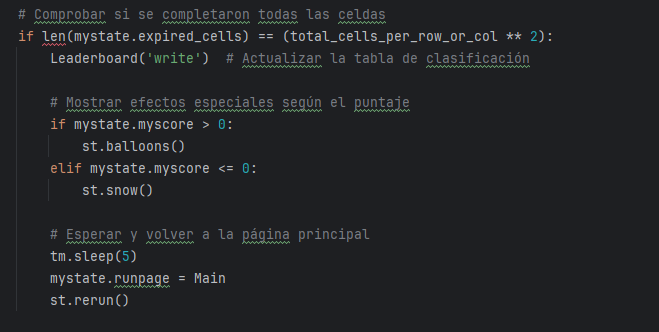

# Requistos vs código
## Requisitos Funcionales y Criterios de Aceptación

| Requisito y Criterios de Aceptación                                                                                                                                                                                                                                                                                                                                                                                                                                                                                                                                                                                                                     | Código/Imagen                                                                                                                   |
|---------------------------------------------------------------------------------------------------------------------------------------------------------------------------------------------------------------------------------------------------------------------------------------------------------------------------------------------------------------------------------------------------------------------------------------------------------------------------------------------------------------------------------------------------------------------------------------------------------------------------------------------------------|---------------------------------------------------------------------------------------------------------------------------------|
| **1. Configuración de Nivel de Dificultad.** **Requisito:** El sistema debe permitir a los jugadores seleccionar el nivel de dificultad antes de comenzar el juego. **Criterios de Aceptación:** - Opciones de dificultad fácil, medio y difícil disponibles para selección. - La configuración de dificultad debe influir en la mecánica del juego, como la frecuencia de regeneración de imágenes y la puntuación. - Tiempos de regeneración específicos:   - Fácil: cada 8 segundos.   - Medio: cada 6 segundos.   - Difícil: cada 5 segundos.                                                                               |                                                                                                          |
| **2. Inicialización del Tablero.** **Requisito:** Al comenzar un juego, el sistema debe inicializar el tablero con un conjunto aleatorio de imágenes basado en la dificultad seleccionada. **Criterios de Aceptación:** - El tablero debe ser llenado con imágenes de emojis que corresponden a la dificultad elegida. - Ninguna imagen objetivo (emoji de la barra lateral) debe aparecer más de una vez en el tablero inicial. - La imagen objetivo debe ser seleccionada aleatoriamente y mostrada en la barra lateral.                                                                                                               |                                                                           |
| **3. Parametrización del Nombre del Jugador y País.** **Requisito:** El sistema debe permitir a los jugadores ingresar su nombre y país antes de comenzar el juego. **Criterios de Aceptación:** - Debe existir un campo de texto para que los jugadores ingresen su nombre y país. - Es posible que los campos de nombre y país estén vacíos, pero en ese caso no se muestra el _Leaderboard_ - La información del jugador debe persistir durante la sesión de juego.                                                                                                                                                                   |                                              |
| **4. Inicialización del Juego.** **Requisito:** El juego debe empezar con la interfaz de los emojis y barra lateral izquierda. **Criterios de Aceptación:** - El juego debe mostrar un respectivo tablero según la dificultad elegida:    - Fácil: Tablero de 6x6.    - Medio: Tablero de 7x7.    - Difícil: Tablero de 8x8. - La imagen a buscar debe ser aleatoria. - La imagen objetivo puede repetirse en distintas ocasiones - El tablero debe cambiar su patrón cuando:    - Se seleccione un emoji (Independiente de ser correcto o no).    - No se seleccione un emoji y pasen N segundos según la dificultad. |                                                                |
| **5. Gestión para Puntos.** Requisito:** El sistema debe clasificar las elecciones del jugador según el emoji. **Criterios de Aceptación:** - Si el jugador se equivoca siempre perderá -1 punto independiente del modo. - En cambio, si el jugador no responde y pasan los N segundos según el modo, siempre perderá -2 puntos. - Para ganar puntos, se clasifica de la siguiente manera:    - Fácil: Ganas 10 puntos.    - Medio: Ganas 8 puntos.    - Difícil: Ganas 6 puntos.                                                                                                                                               |                                                                          |
| **6. Tabla de Clasificación.** Requisito:** El juego debe permitir una clasificación de los usuarios que participen en el juego. **Criterios de Aceptación:** - Se debe mostrar el top 3 de los jugadores con mayor puntuación independiente del modo. - El orden es de forma descendente desde la mayor puntuación.                                                                                                                                                                                                                                                                                                                        |     |
| **7. Finalización del Juego.** Requisito:** Al finalizar el juego, el sistema muesta confetí o nieve dependiendo del resultado y se regresa al menú principal. **Criterios de Aceptación:** - El juego se completa cuando todos los botones han sido presionados. - Si la puntuación es positiva, se muestra el confetí, en caso contrario, se muestra la nieve. - Si la puntuación del jugador sobrepasa la de algun jugador en el top, es reubicado en la respectiva posición del top.                                                                                                                                                                                                                                                                      |    |

